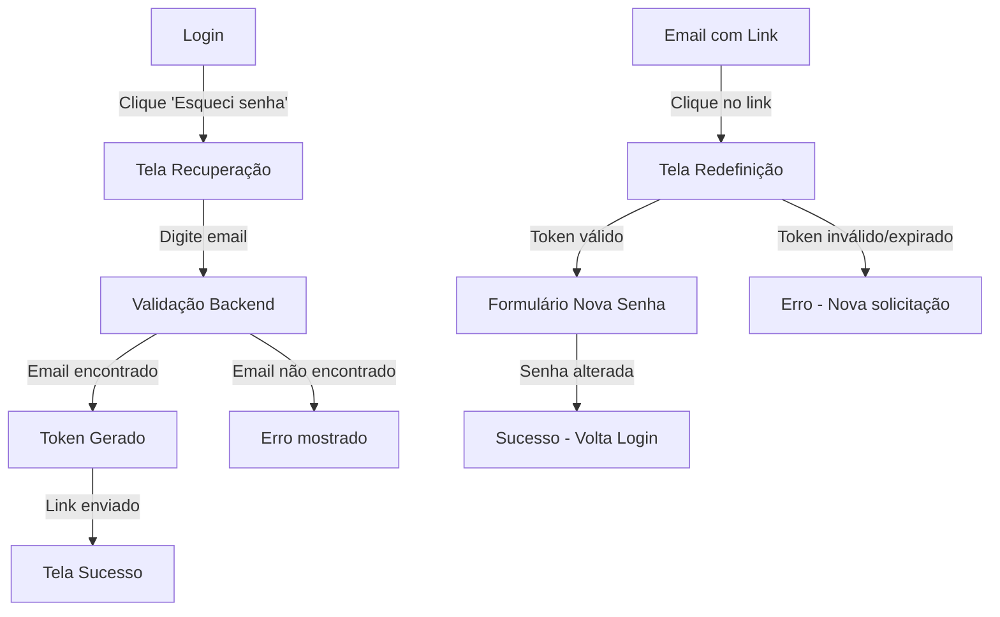

# 🔐 Sistema de Recuperação de Senha

## ✅ Implementação Completa

O fluxo de recuperação de senha foi implementado com sucesso no seu app Electron! Agora é possível:

### 🎯 Funcionalidades Implementadas

1. **Clique em "Esqueci minha senha"** no login
   - Botão funcional que redireciona para a tela de recuperação
   
2. **Tela de recuperação de senha** (`/auth/forgot-password`)
   - Formulário para digitar email
   - Validação de email
   - Feedback visual de sucesso/erro
   
3. **Sistema de tokens seguros**
   - Tokens únicos de 64 caracteres (hex)
   - Expiração de 1 hora
   - Cleanup automático de tokens antigos
   
4. **Tela de redefinição** (`/auth/reset-password`)
   - Validação automática de token na URL
   - Formulário com senha e confirmação
   - Indicador de força da senha
   - Estados de loading, erro e sucesso

### 🛠️ Componentes Criados

- **Backend:**
  - `PasswordReset` model no Prisma
  - Métodos no `AuthService`: `requestPasswordReset`, `validatePasswordResetToken`, `resetPassword`
  - Handlers IPC para comunicação Electron
  
- **Frontend:**
  - `ForgotPassword.tsx` - Tela para solicitar recuperação
  - `ResetPassword.tsx` - Tela para redefinir senha
  - Rotas configuradas no sistema de navegação
  - Integração com o botão no login

### 🔄 Fluxo Completo



### 📧 Integração de Email (Próximo passo)

Para completar o sistema, você precisa configurar o envio de emails. As opções são:

1. **Nodemailer** (SMTP)
2. **SendGrid API**
3. **AWS SES**
4. **Resend** (recomendado para simplicidade)

O link seria algo como:
```
myapp://reset-password?token=abc123...
```

### 🧪 Como Testar

1. Execute o app: `npm run dev`
2. Vá para o login
3. Clique em "Esqueci minha senha"
4. Digite um email cadastrado
5. Para testar o reset, acesse diretamente:
   `http://localhost/#/auth/reset-password?token=TOKEN_GERADO`

### 🔒 Recursos de Segurança

- ✅ Tokens únicos e seguros (crypto.randomBytes)
- ✅ Expiração de 1 hora
- ✅ Tokens de uso único (marcados como `used`)
- ✅ Cleanup automático de tokens antigos
- ✅ Validação de força de senha
- ✅ Hash seguro da nova senha (bcrypt)
- ✅ Transação atômica para update senha + marcar token usado

### 🎨 Interface

- Design consistente com o login existente
- Estados de loading intuitivos
- Mensagens de erro claras
- Feedback visual de progresso
- Responsivo e acessível

---

**Status: ✅ IMPLEMENTADO E FUNCIONAL**

Próximo passo recomendado: Configurar envio de emails para completar o fluxo.